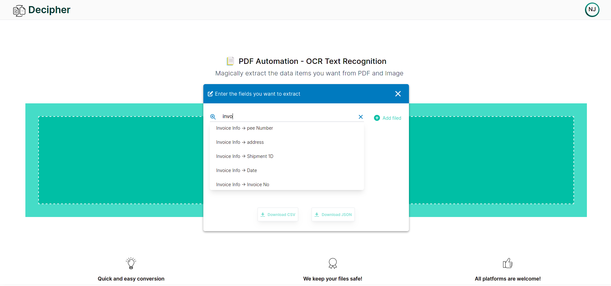

## DECIPHER 2.0 | <i>PDF Automation - OCR Text Recognition</i>

### Problem Statement

    
There are various validation rule engines across the industry. There are all Converting PDF documents into structured data which you can use in other systems is however not a trivial task and many businesses find themselves manually re-keying product data from PDF documents into spreadsheets or databases. 

    
Extraction of critical data from those PDF’s(Invoice, receipts, sales orders) and in return receive structured data. Need to convert PDF to text for download

### Assumptions/Callouts
- Any data set can be used. Use supply chain related data
- Pick few sample PDF's with watermark 

### Solution - <i>DECIPHER 2.0</i>
Decipher 2.0 is a user-friendly tool that identifies the data items one wants to extract from their uploaded invoice and gives back the desired fields as a downloadable file in multiple formats.It comes with the following built-in functionalities:

    
Extracts useful information from large, multiple PDFs in just seconds 

    
Adjusts the alignment of randomly oriented pdf images

    
Remove watermarks to provide flawless results

    
Store the extracted information in cloud storage for future access

## Architecture

## Technology Stack
Frontend
- **React JS :** *web-app user interface*
- **Netlify :** *deploying the web-app*

Backend
- **Express.js :** *setting up backend server*
- **Heroku :** *deploying backend services*

Storage
- **MongoDB :** *storing schemas*
- **Cloudinary :** *cloud storage for files*

Tools and Languages
- **Tesseract :** *extracting text through OCR*
- **Python :** *parsing pdf and images*

## Screenshots

## Future Additions

    
<b>Bounding Box Flexibility :</b> Users can select their own bounding boxes and this feature can be implemented using JCrop Library

    
<b>Language Translation :</b> PDFs can be translated from one language to other using libraries like textblob or googletrans

    
<b>QR Code Reader :</b> Values of QR Codes or Bar Codes in PDFs can also be decoded and then stored using pyzbar library

    
<b>Processing Handwritten Invoices :</b> Text from handwritten invoices can be extracted and parsed. For this, Tensorflow library can be used to create and train a neural network by using datasets of extracted invoices.

